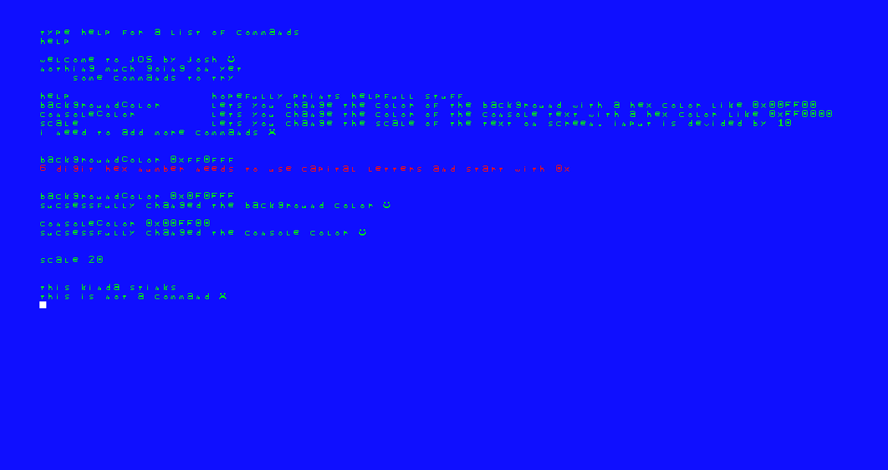

# jOS by josh
an operating system built from scratch in c and x86 assembly, with no external libraries. implements booting and kernel initialization, and basic graphical frame buffer. 

## Features
- custom bootloader (EFI)
- kernel written in C with memory and hardware initialization
- console output with color support
- basic shell commands

## Building
requires GCC cross compiler. (wiki.osdev.org/GCC_Cross-Compiler)

make       - build the os image.
make run   - attempt to boot the os after building using qemu and OVMF EFI emulator.
make clean - deletes all related local files from building.
make all   - runs all above commands in proper order to rebuild and test. 

qemu and GDB were used for testing. 

## License
GNU General Public License v3

